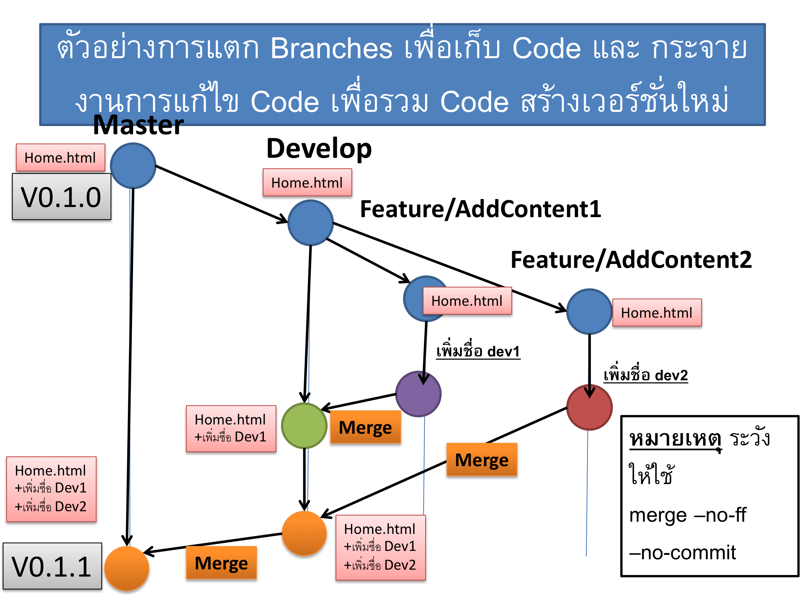
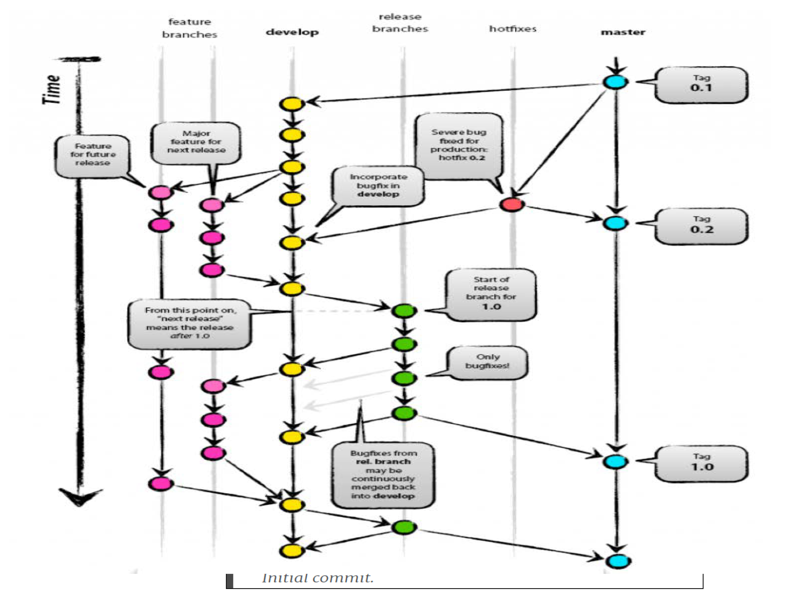

# Master branch for testing git version control  
This will be the baseline branch for simulating git version control scenarios. The branches that should be branched out are:  
> - Master (default/baseline code)
>> - Hotfixes (for fix bugs)
>> - Release (for releasing)
> - Develop (for deverloping)
>> - Feature/Main (for main feature/more than 1 deverloper)
>> - Feature/Future (for other feature in next release/another deverloper)
  
Here example:  
  
  

  
  
- When new code is developed or a feature is added, a *pull request* is made to merge the files from the sub-branch back into the master branch (or release branch).  

- Make sure each version is properly tagged before releasing.